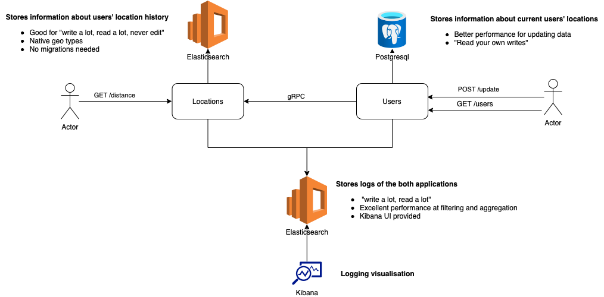

# Golang capstone project

## Assignment:
You can check it at [GridU public repository](https://github.com/gridu/GOLANG_FOR_STUDENTS)

## Architecture:

Application is made of two microservices


Directory naming follows [project-layout](https://github.com/golang-standards/project-layout) standatrs

API documentation for each microservice can be found if `api` directories
- [Locations](locations/api/v1.yml)
- [Users](users/api/v1.yml)

**Important: for the study purpose I used the same database for locations and logging. In a real project it must be separated storages**

## Development environment

You can run all the required infrastructure using the command

```
make dev-services
```

it will start both databases and the monitoring services.

- Open `http://localhost:8007` to access the [adminer](https://www.adminer.org) panel
- Open `http://localhost:8004` to access the [kibana](https://www.elastic.co/kibana/) panel

### Migrations
There is a migration app in `tools/migrate/migrate.go`, which allows you to control the `users` database structure.
[Source to the library and documentation](https://github.com/golang-migrate/migrate)

**TLDR**:
- Files in `users/migrations` represent migrations. Both `up` and `down` migrations required
- `go run tools/migrate/migrate.go up` to setup database
- `go run tools/migrate/migrate.go 7` to set specific version
- `go run tools/migrate/migrate.go drop` you never want to use it on your production server

### Services
- `make run-locations` to run the locations service
- `make run-users` to run the users service


# Testing

## Unit testing
Tests do not require database being up and migrated, because in unit cases the fake storage is always used.
You can run testing by `make-test` command

## Integration testing
For these you need the test-db set up

```shell
docker-compose -f deploy/docker-compose.yml up db_test -d
go run tools/migrate/migrate.go up test
make test-integration
```

Make sure you run tests with `make` command, or you provided `integration` tag. Otherwise, the tests won't be run.

# Release
Just run `make release` and wait until the message that both servers are ready arrive. 

- You can access the `users` service on port 8000
- And `locations` service on port 8001